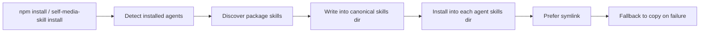

# @zktlove/self-media-skill

一个面向 AI 编码 Agent 的自媒体技能包。

它把两个可复用的 workflow skill 打包成一个 npm 安装器，在安装时自动探测本机支持的 Agent，并把 skills 安装到对应的 skill 目录里。

当前发布内容：

- `self-media-skill`
- `social-copywriting-workflow`
- `xiaohongshu-auto-publish`

## 这个包解决什么问题

平时分发 skill 最大的问题不是写 `SKILL.md`，而是：

- 不同 Agent 的 skill 目录不一样
- 用户机器上装了哪些工具不确定
- 手动复制容易漏、容易装错目录
- Windows 下 symlink 和 copy 行为还不完全一样

这个包的目标很直接：

1. 自动发现当前机器已经安装的 Agent
2. 自动发现包里可安装的 skills
3. 自动安装到对应的 skill 目录
4. 优先 symlink，失败回退 copy

## Features

- 支持 `global` 和 `project` 两种安装范围
- 自动扫描包根目录和一级子目录中的 `SKILL.md`
- 自动探测已安装 Agent
- 默认走 canonical 目录再分发到各 Agent
- 支持 `install`、`update`、`uninstall`
- 支持 `--agent`、`--project`、`--dry-run`
- npm 包体轻，当前 `unpacked size` 约 `155 kB`

## Included Skills

### `self-media-skill`

总入口 skill，只负责分流。

- 遇到抖音文案仿写、取材、搜索、转写，走 `social-copywriting-workflow`
- 遇到小红书选题、成稿、配图、自动发布，走 `xiaohongshu-auto-publish`

### `social-copywriting-workflow`

面向抖音/短视频文案工作流，包含：

- 对标视频下载
- 音频抽取
- 转写
- 热榜查询
- 搜索结果转仿写素材包

### `xiaohongshu-auto-publish`

面向小红书图文自动发布工作流，包含：

- 对标内容收集
- 标题正文生成
- 配图生成
- 浏览器自动上传和发布

## Supported Agents

当前第一版兼容这些工具：

| Agent | 标识 | Project 路径 | Global 路径 |
| --- | --- | --- | --- |
| Codex | `codex` | `.agents/skills` | `~/.codex/skills` |
| Claude Code | `claude-code` | `.claude/skills` | `~/.claude/skills` |
| Cursor | `cursor` | `.agents/skills` | `~/.cursor/skills` |
| Trae | `trae` | `.trae/skills` | `~/.trae/skills` |
| OpenCode | `opencode` | `.agents/skills` | `~/.config/opencode/skills` |
| GitHub Copilot | `github-copilot` | `.agents/skills` | `~/.copilot/skills` |
| Gemini CLI | `gemini-cli` | `.agents/skills` | `~/.gemini/skills` |
| Kimi Code CLI | `kimi-cli` | `.agents/skills` | `~/.config/agents/skills` |
| Windsurf | `windsurf` | `.windsurf/skills` | `~/.codeium/windsurf/skills` |
| OpenClaw | `openclaw` | `skills` | `~/.openclaw/skills` |
| Trae CN | `trae-cn` | `.trae/skills` | `~/.trae-cn/skills` |
| Qoder | `qoder` | `.qoder/skills` | `~/.qoder/skills` |
| Qwen Code | `qwen-code` | `.qwen/skills` | `~/.qwen/skills` |

## Quick Start

### 全局安装

```bash
npm install -g @zktlove/self-media-skill
```

安装后会自动执行：

1. 扫描当前机器上已安装的 Agent
2. 扫描当前包内可安装的 skills
3. 写入 canonical 目录
4. 再同步安装到各 Agent skill 目录

### 查看支持的 Agent

```bash
self-media-skill list-agents
```

### 查看包内 skills

```bash
self-media-skill list-skills
```

### 手动安装

```bash
self-media-skill install
```

### 指定 Agent 安装

```bash
self-media-skill install --agent codex,cursor,qoder
```

### 项目级安装

```bash
self-media-skill install --project
```

### 预演但不落盘

```bash
self-media-skill install --dry-run
```

### 强制 copy 模式

```bash
self-media-skill install --mode copy
```

### 更新

```bash
self-media-skill update
```

### 卸载

```bash
self-media-skill uninstall --agent codex,github-copilot
```

## Installation Model

安装器当前采用“canonical + 分发”的模型：



canonical 目录默认是：

- Global: `~/.self-media-skill/skills`
- Project: `./.self-media-skill/skills`

## Commands

```bash
self-media-skill install
self-media-skill install --project
self-media-skill install --agent claude-code,qoder
self-media-skill install --dry-run
self-media-skill update
self-media-skill uninstall --agent codex
self-media-skill list-agents
self-media-skill list-skills
```

## Package Structure

```text
self-media-skill/
├─ bin/
│  └─ self-media-skill.js
├─ lib/
│  ├─ agents.js
│  ├─ discover-skills.js
│  ├─ installer.js
│  └─ publish.js
├─ tests/
│  ├─ agents.test.js
│  ├─ discover-skills.test.js
│  ├─ installer.test.js
│  └─ publish.test.js
├─ SKILL.md
├─ README.md
├─ LICENSE
├─ package.json
├─ social-copywriting-workflow/
└─ xiaohongshu-auto-publish/
```

## Release Workflow

发布前建议固定跑这几步：

```bash
npm test
npm run pack:check
npm run release:check
npm publish --access public
```

查看内置发布提示：

```bash
npm run publish:help
```

## FAQ

### 为什么 `npm publish` 会报 2FA 错误？

因为 npm 账号启用了更严格的发布安全策略。你需要：

- 发布时附带当前 6 位 OTP
- 或者改用带 `bypass 2fa` 权限的 granular token

### 为什么有时会变成 copy，不是 symlink？

常见原因是：

- Windows 权限限制
- 目标目录已有冲突文件
- 当前环境不允许创建符号链接

这时安装器会自动回退成 copy，避免安装直接失败。

### 为什么包里没有公众号 workflow？

因为这个包当前只发布两个子 skill：

- `social-copywriting-workflow`
- `xiaohongshu-auto-publish`

公众号相关目录已经从当前包的发布范围里移除。

## License

MIT
